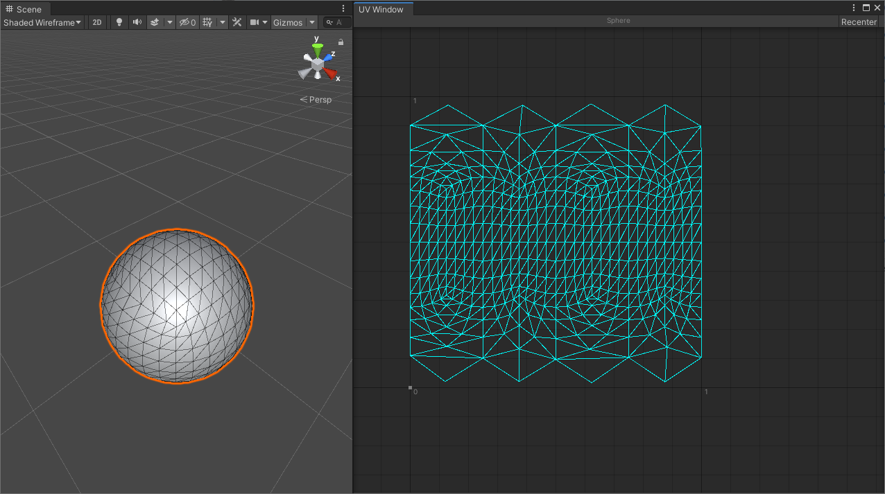
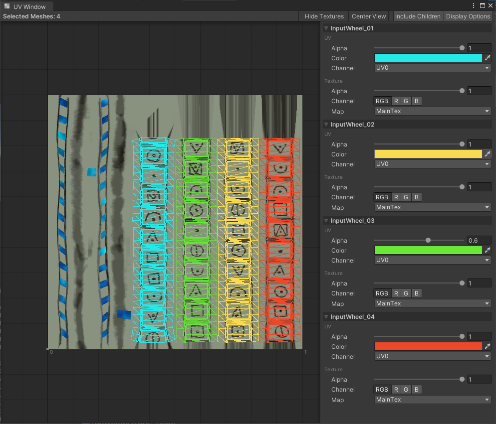

# Mesh Debugging

## Description
A suite of utilities useful for finding issues or simply visualizing properties such as UVs or normals meshes.

### UV Window

A dedicated editor window to visualize UVs and textures of selected meshes in the scene.

### Mesh Info

A tool to draw Gizmos in the SceneView which indicate mesh normals and list basic statistics such as vertex count.

### Scene View Shading

Chose from a set of shaders to color objects in the scene to debug mesh properties such as vertex colors, local normals or UVs.

### Compatibility

This package is supported with Unity 2019.1 or newer. Please open an issue if you encounter any errors.

### Support

If you'd like to support this and similar projects, buy us a coffee: 

All income will directly benefit the team in the form of coffee, tea and office plants. It might not be much, but it keeps up morale and helps us working on additional side projects.
